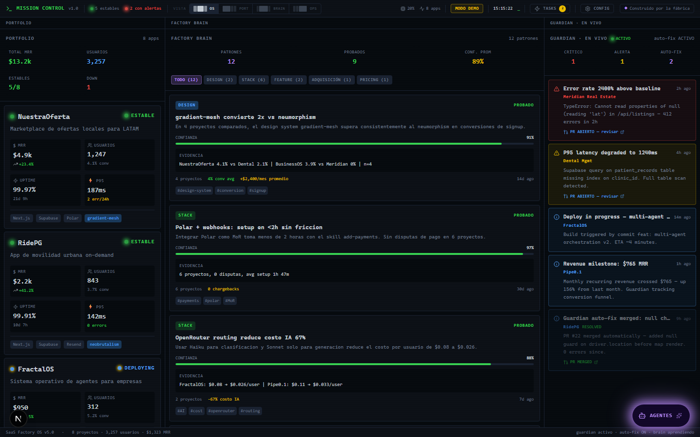
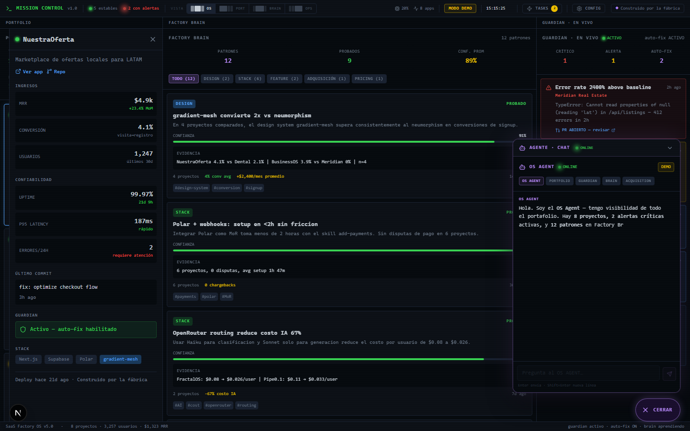
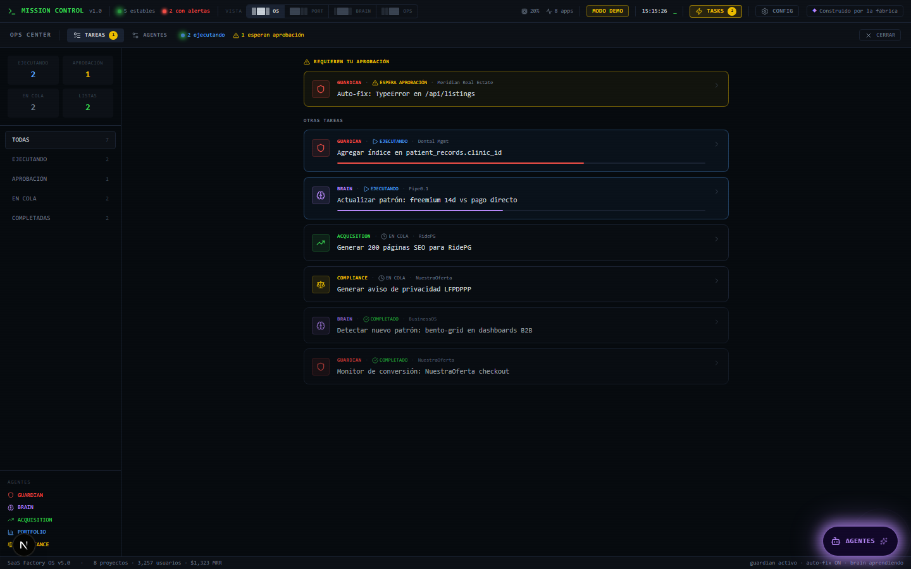
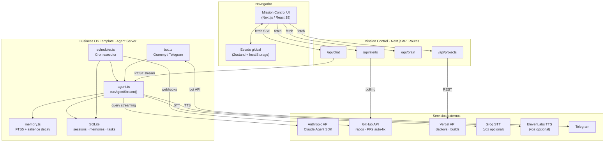
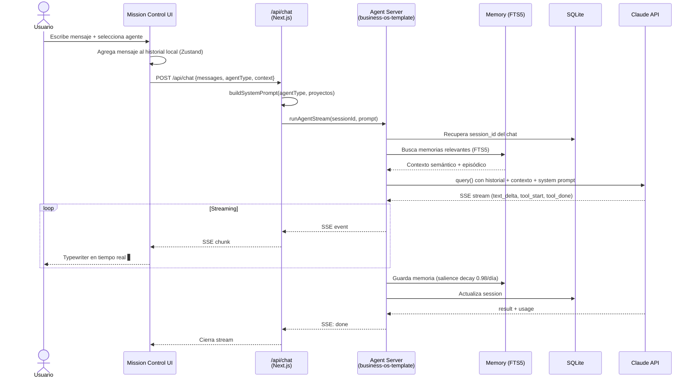
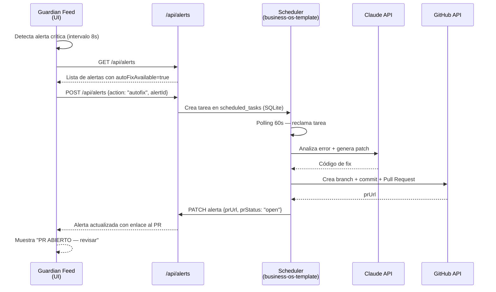

# Mission Control OS

[](LICENSE)

Panel de control para portafolios de SaaS. Monitorea proyectos, detecta errores en tiempo real, aprende patrones entre productos y conversa con agentes de IA especializados — todo desde una sola interfaz estilo OS.

## El problema

Un founder que opera varios productos SaaS en paralelo vive en una docena de pestañas abiertas: Vercel para ver deploys, GitHub para revisar errores, Stripe para el revenue, Google Analytics para conversión, y así por cada proyecto. Cuando algo se rompe en producción a las 2am, tarda minutos en identificar cuál proyecto falló, qué lo causó y cómo revertirlo.

Tres problemas concretos:

1. **Sin visibilidad unificada.** No existe un lugar donde ver el estado de salud, ingresos, errores y uptime de todos los proyectos al mismo tiempo. El contexto se pierde al saltar entre herramientas.

2. **El conocimiento no se acumula.** Cuando un patrón de diseño, pricing o adquisición funciona en un producto, esa información queda en la cabeza del founder. El siguiente producto arranca desde cero.

3. **La respuesta a incidentes es manual y lenta.** Un spike de errores requiere que alguien lo detecte, lo diagnostique, escriba el fix y abra un PR. En un portafolio de varios SaaS eso no escala.

Mission Control resuelve los tres: un OS unificado con monitoreo en tiempo real, memoria de patrones entre proyectos, y un sistema agéntico que detecta errores críticos, genera el fix y abre el PR automáticamente.

## Capturas

**Vista Standard** — Portfolio · Factory Brain · Guardian en equilibrio



**Chat con agentes IA** — OS Agent respondiendo con contexto del portafolio



**OPS Center — Tareas** — tasks de agentes en ejecución, cola y esperando aprobación humana



## Funcionalidades

### Panel Portfolio
- Vista de todos los proyectos con estado (`healthy`, `degraded`, `down`, `deploying`)
- Métricas por proyecto: MRR, crecimiento de ingresos, usuarios activos, tasa de conversión, uptime y latencia p95
- Cajón de detalle al hacer clic en un proyecto (último commit, errores últimas 24h, stack tecnológico)
- Gestión CRUD de proyectos desde la configuración

### Factory Brain
- Patrones aprendidos entre proyectos, clasificados por categoría: diseño, stack, feature, adquisición y pricing
- Nivel de confianza por patrón: `proven`, `likely` o `experimental`
- Evidencia concreta con porcentajes y conteo de proyectos que lo respaldan
- Filtros por categoría con contadores

### Guardian · En Vivo
- Feed de alertas en tiempo real con nuevas entradas cada 8 segundos
- Tres niveles de severidad: crítico, advertencia e informativo
- Auto-fix disponible para errores críticos: genera un PR de GitHub automáticamente
- Contadores de alertas activas y fixes aplicados

### Chat con Agentes IA

> **Nota:** La capa agéntica de Mission Control está basada en [business-os-template](../business-os-template). Ese proyecto provee el servidor de agentes completo: streaming SSE con el Claude Agent SDK, pool de sesiones persistente, memoria FTS5 con decaimiento por relevancia, tareas cron por categoría y bot de Telegram. Mission Control consume esa infraestructura como backend; no reimplementa la lógica agéntica.

Cinco agentes especializados con personalidad y contexto propio:

| Agente | Foco |
|--------|------|
| **OS Agent** | Orquesta todo el portafolio — visión completa |
| **Portfolio** | Revenue, KPIs, crecimiento y estado financiero |
| **Guardian** | Alertas, errores y estabilidad en producción |
| **Brain** | Patrones aprendidos y evidencia entre proyectos |
| **Acquisition** | Tráfico, SEO, primeros usuarios |

Los agentes responden con datos reales del portafolio. El input soporta Markdown básico (`**negrita**`, `` `código` ``).

### Vistas del Dashboard
Cuatro layouts que redistribuyen el ancho de los paneles:
- **Standard** — distribución equilibrada
- **Portfolio** — enfoque en proyectos
- **Brain** — enfoque en patrones
- **Ops** — enfoque en Guardian

### Modo Demo
Funciona sin ninguna API key. Carga proyectos, patrones y alertas de ejemplo. Los agentes responden con respuestas predefinidas que ilustran sus capacidades. Ideal para explorar la interfaz antes de conectar servicios reales.

### Configuración
- **Proyectos**: agregar, editar y eliminar proyectos con todos sus metadatos
- **APIs**: configurar tokens de Vercel y GitHub para el modo real

## Arquitectura del sistema

### Diagrama de componentes



### Flujo secuencial — Chat con agente



### Flujo secuencial — Auto-fix Guardian



## Requisitos

- Node.js 18 o superior
- npm, yarn, pnpm o bun

## Instalación

```bash
git clone <url-del-repositorio>
cd mission-control
npm install
```

## Uso

### Modo desarrollo

```bash
npm run dev
```

Abre [http://localhost:3000](http://localhost:3000) en el navegador.

### Producción

```bash
npm run build
npm start
```

## Variables de entorno

Para activar el modo real (agentes con IA y datos de producción), crea un archivo `.env.local`:

```env
# Claude AI — para el chat con agentes
ANTHROPIC_API_KEY=sk-ant-...

# GitHub — para datos de repositorios y PRs de auto-fix
GITHUB_TOKEN=ghp_...

# Vercel — para datos de deploys
VERCEL_TOKEN=...
```

Sin estas variables, la app funciona en **Modo Demo** automáticamente.

## Stack tecnológico

| Capa | Tecnología |
|------|-----------|
| Framework | Next.js 16 (App Router) |
| UI | React 19 + TypeScript |
| Estilos | Tailwind CSS v4 |
| Estado global | Zustand con persistencia en localStorage |
| Iconos | Lucide React |
| IA (agentes) | Claude API (Anthropic) |

## Estructura del proyecto

```
app/
  page.tsx              # Layout principal de 3 paneles
  layout.tsx            # Root layout
  api/
    chat/route.ts       # Endpoint del chat con agentes IA
    alerts/route.ts     # Feed de alertas Guardian
    brain/route.ts      # Patrones del Factory Brain
    projects/route.ts   # Datos de proyectos

components/
  OSHeader.tsx          # Barra superior con vista y controles
  PortfolioPanel.tsx    # Panel izquierdo de proyectos
  BrainPanel.tsx        # Panel central de patrones
  GuardianFeed.tsx      # Panel derecho de alertas
  AgentChat.tsx         # Chat flotante con agentes
  ChatBubble.tsx        # Wrapper del chat flotante
  TasksOverlay.tsx      # Panel de tareas de agentes
  settings/             # Componentes de configuración

lib/
  types.ts              # Tipos TypeScript
  store.ts              # Estado global (Zustand)
  agent-context.ts      # Configuración y prompts de agentes
  fixtures.ts           # Datos de demo
  utils.ts              # Utilidades
```

## Licencia

[GNU Affero General Public License v3.0](LICENSE) © 2026 pedro2g

El código fuente es público. Cualquier uso en red (SaaS, servicio hosted) que incorpore este código debe publicar sus modificaciones bajo la misma licencia. Para uso comercial sin esta restricción, contacta al autor.
